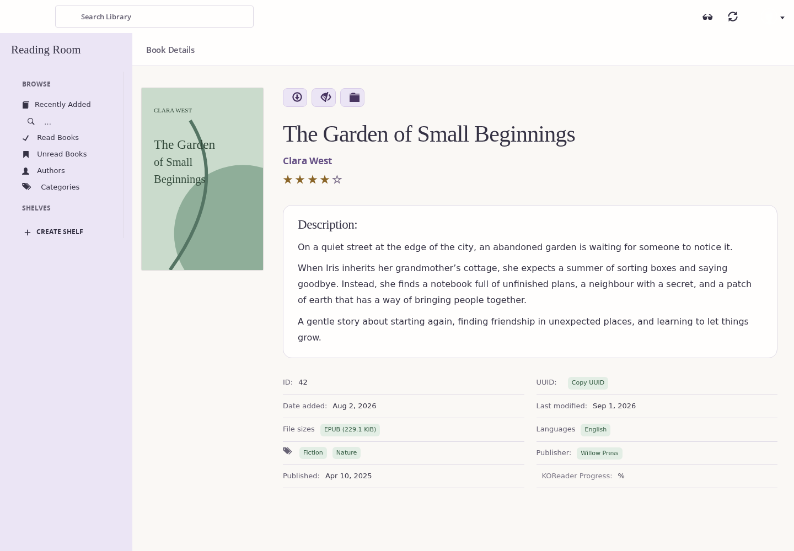
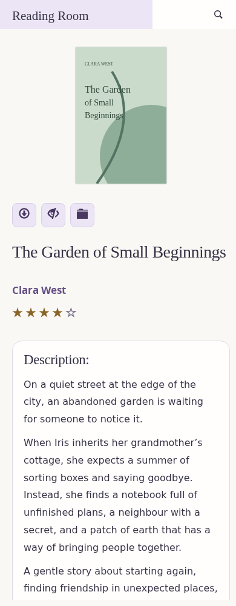

# Pastel

Select **Pastel Theme** in the theme settings, or use **Switch Theme** to cycle
through Standard, caliBlur, and Pastel. Existing theme preferences are preserved.

Pastel adapts caliBlur's Jinja templates, Bootstrap shell, library grid and jQuery
interactions. It adds no frontend framework or build step. Its scoped stylesheet
uses warm paper, lavender and sage surfaces with dark text and visible focus rings.

The book view inherits Standard's complete CWA action and modal contract, as
caliBlur does. Two small template blocks place the sanitized description before
metadata in reading order. Metadata uses two compact columns on desktop and one
on phones; books without descriptions go directly to their metadata.

Validation includes theme selection and full-page/XHR rendering for all public
themes, with and without descriptions. Chromium previews use synthetic book data;
they do not exercise a live library's download, email, or editing services.

Synthetic-data previews:

